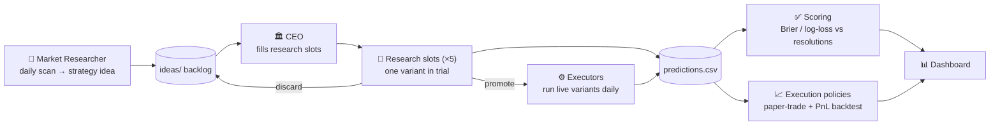

# orakel — an agentic prediction-market research firm

## 📊 [Dashboard →](https://orakel-dashboard.felixandreas.workers.dev) _(private, Cloudflare Access)_

A git-tracked workspace where AI agents run a small research firm that hunts for **edge** on
[Polymarket](https://polymarket.com) prediction markets. The unit of research is a
**strategy** (not a market): agents invent strategies, trial them across markets, score them
against resolutions, promote what works, and simulate how executing the resulting predictions
would have performed.

Core equation: **`edge = model_probability − market_price`**. Read-only for now — orakel
*predicts* and *paper-trades*; it places no orders and holds no keys.

orakel is the successor of [`poly`](https://github.com/felix-andreas/poly), which proved the
scoring loop (consensus beat the market baseline on its first resolved markets) but organized
research around single markets, which didn't scale and never produced reusable strategies.

## The loop

## Map

| Path | What |
|------|------|
| [`ARCHITECTURE.md`](ARCHITECTURE.md) | The full map: concepts, lifecycle, conventions |
| [`CONSTITUTION.md`](CONSTITUTION.md) | The CEO's constraints and duties |
| [`CODING.md`](CODING.md) | Coding guidelines for all agents |
| [`ops/`](ops/) | **Canonical current state** + decision log + run manifests |
| [`roles/`](roles/) | Role playbooks, memories, inboxes (CEO, market researcher, …) |
| [`ideas/`](ideas/) | Strategy-idea backlog (market researcher → CEO) |
| [`strategies/`](strategies/) | Strategy families → variants → applications |
| [`predictions/`](predictions/) | Append-only prediction log + resolutions |
| [`scoring/`](scoring/) | Brier / log-loss scorer (Rust) |
| [`execution/`](execution/) | Execution policies + PnL backtesting |
| [`wiki/`](wiki/) | Durable cross-strategy knowledge |
| [`tools/r2data/`](tools/r2data/) | R2 data helper — git stays the index, bytes live in R2 |
| [`dashboard/`](dashboard/) | Human dashboard (Rust on Cloudflare Workers) |

## Humans

Felix owns the daily trigger, budget, and secrets. Everything else — including restructuring
this firm — is the CEO's job, constrained only by [`CONSTITUTION.md`](CONSTITUTION.md).
Messages for Felix land in [`roles/felix/inbox/`](roles/felix/inbox/).
